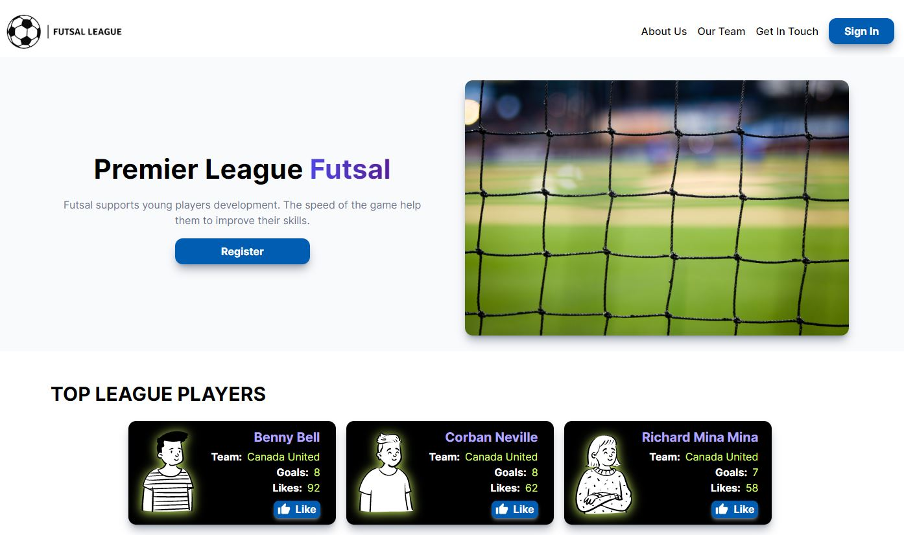

# Futsal League Application

Futsal League app is a React application that was built for the last project for my BrainStation bootcamp.
This a full-stack application created in two repositories for the [front-end](https://github.com/HpatricioH/futsal-league-client-side) and [back-end](https://github.com/HpatricioH/futsal-league-server-side).

This project was presented in the BrainStation's demo day. You can access the video presentation on the [BrainStation's Graduates](https://brainstation.io/hiring-brainstation-graduates) page, please search for Patricio Huerta under Web Development.

---

## Table of contents

- [Overview](#overview)
  - [The challenge](#the-challenge)
  - [Screenshot](#screenshot)
  - [Links](#links)
- [My process](#my-process)
  - [Built with](#built-with)
  - [What I learned](#what-i-learned)
  - [Continued development](#continued-development)
- [Installation](#Installation)
- [Author](#author)

---

## Overview

I built this application thinking about solving a community of a futsal
(type of soccer) in town that is passionate about this sport.
This application allows users to find information about the league, teams,
players, games schedules, games venues and interact with other users by creating
comments. One of the features of the application is that it will have an admin user that is able to create, delete, update players and teams.

### **The challenge**

Users should be able to:

- View the website's pages depending on their device's screen size
- See hover states for all interactive elements on the page
- Register and login into the website to see teams registered in the league
- Interact with other users, like players and create and delete comments
- See venue and game information for each team

Admin User should be able to:

- Create, Delete update Update players information
- Create and Delete players comments

### **Screenshot**



### **Links**

- Front-End URL: [Front-End Repository](https://github.com/HpatricioH/futsal-league-client-side)
- Live Site URL: [Coming Soon](https://your-live-site-url.com)

## My process

---

### **Built with**

- [React](https://reactjs.org/) - JS library
- [Recoil](https://recoiljs.org/) - State Management Library
- [TailwindCss](https://tailwindcss.com/) - Css Framework
- [Leaflet](https://leafletjs.com/) - Maps API
- [Cloudinary](https://cloudinary.com/home-102622) - Cloud-based image management
- [Axios](https://axios-http.com/docs/intro) - Promise-based to make HTTP requests

### **What I learned**

Most of the stack used to develop the front-end for this web application were a combination of what I learned during the BrainStation Bootcamp and new technology learned
while developing the project.

For example I learn about Recoil for state management, react hooks and to develop faster I decided to learn about TailwindCss

```javaScript
// Recoil Atom to store logged in user data
const { persistAtom } = recoilPersist();

export const userData = atom({
  key: 'userData',
  default: {},
  effects_UNSTABLE: [persistAtom],
});
```

```javascript
// Function that makes scroll the view to the top each time the viewport changes
const ScrollToTop = (props) => {
  const location = useLocation();

  useEffect(() => {
    window.scrollTo(0, 0);
  }, [location]);

  return <>{props.children}</>;
};
```

### **Continued development**

The areas I would be working with are adding more features like creating, deleting, updating teams in order to use all the API endpoints
already created in the back-end.
I would be refactoring the code to make it more readable for other developers.

---

## Installation

Once repo is cloned, run `npm i` from the futsal league folder to install all the dependencies required.
To start the application use `npm start`.
This should be done after the [Back-End](https://github.com/HpatricioH/futsal-league-client-side) has been installed.

---

## Author

<!-- - Website - [Patricio Huerta]() -->

- LinkedIn - [Patricio Huerta](https://linkedin.com/in/patricio-huerta)

---
